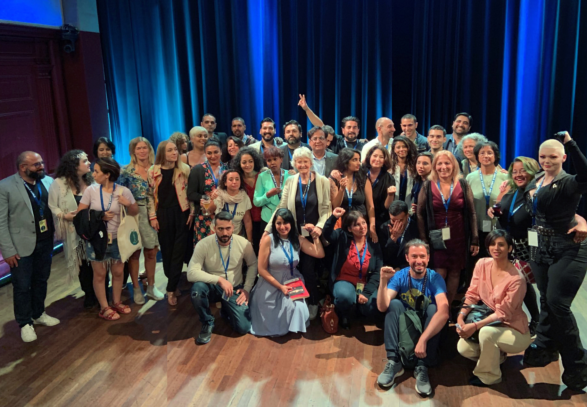
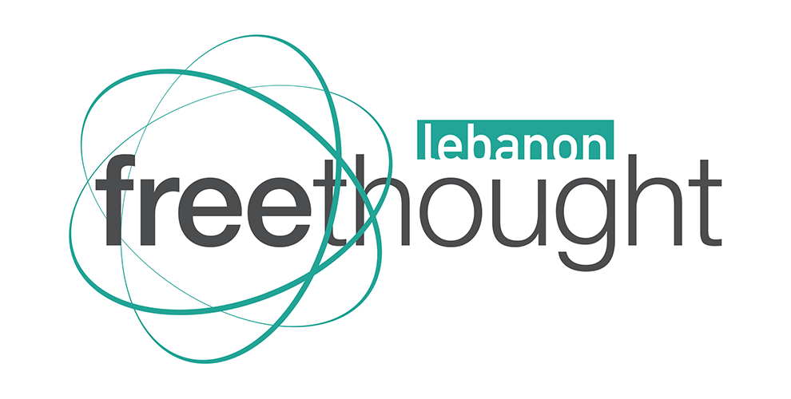
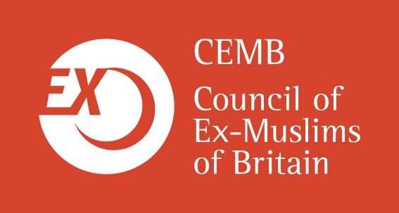
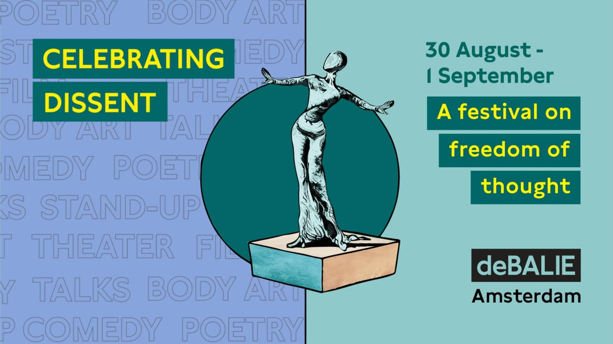
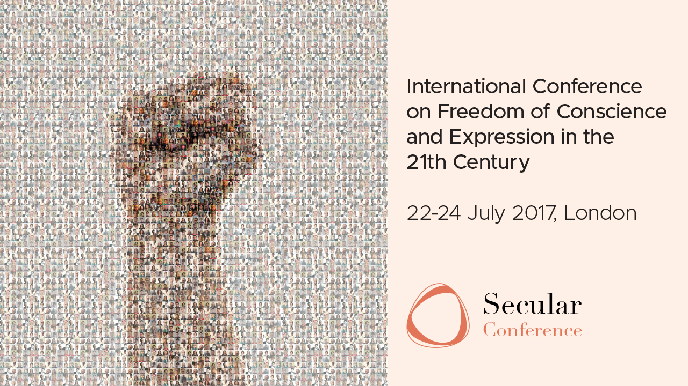

About Celebrating Dissent 2022

    

        

            <strong>Celebrating Dissent 2022</strong> is a two-day
            conference which will be held in Cologne,
            Germany on August 20-21, 2022.
        

        

            <strong>CD2022</strong> is the largest and most prominent
            gathering of ex-Muslims, freethinkers, and
            intellectuals championing freedom of
            thought, since the beginning the COVID-19
            pandemic.
        

    

Photo by Jenny Wenhammar via humanisternasyd.wordpress.com

<!-- Background. -->

    

        

            

                

                    Organized by the “Freethought Lebanon” and 
                    “Council of Ex-Muslims of Britain”, with the support of 
                    “VHS Cologne”, this conference will gather nearly 50
                    speakers from 30 countries worldwide, to celebrate
                    freethought and dissent through talks, poetry, film,
                    music, and comedy.
                

                

                    Countless atheists, non-believers and ex-Muslims
                    continue to face persecution around the world. These
                    include threats of social exclusion, economic
                    discrimination, physical and emotional abuse, legal
                    oppression, gender-based violence, and even death.
                

                

                    Despite this, every criticism of Islam is considered
                    ‘Islamophobia’ by some on the regressive Left, whilst
                    every refugee or Muslim is portrayed as a threat by the
                    far-Right.
                

                

                    Supporting ex-Muslims, however, is a human rights issue. A
                    defense of freedom of conscience and expression, includes the
                    right to be free from and criticize Islam and the religious-Right.
                    Also, xenophobia and anti-Muslim bigotry dehumanizes and
                    endangers all those deemed ‘other,’ including ex-Muslims.
                     
                    More than ever, it is paramount to highlight and
                    strengthen individuals and organizations that protect
                    the rights of Islam’s non-believers, challenge apostasy
                    and blasphemy laws and confront xenophobia. Like the
                    religious-Right, secularists must network and
                    coordinate efforts globally to bring about change.
                

            

        

        

            
        

	

<!-- Purpose of CD2022. -->

    
Purpose of CD2022

    

        

            Celebrating Dissent 2022 aims to bring ex-Muslim activists together
            to strategize, gain strength, and increase visibility.
        

        

            At the core of the conference lies the right of Islam’s non-believers to question,
            doubt, challenge and celebrate the rights to apostasy and blasphemy.
        

        

            The conference aims to achieve two goals:
        

    

	
	

    

    

        

            To strength networking efforts
            among the world’s ex-Muslim and
            atheist activists and organizations
        

    

    

        

            To raise the voice of ex-Muslims
            and legitimize the right to
            apostasy and blasphemy
        

    

    

    

        

            

                Coming together and sharing expertise is highly important to foster a
                sense of solidarity and unity among activists and organizations,
                especially with regards campaigning and protection of atheists at risk.
            

        

        

            

                To this end, we will seek to secure media coverage of this event and
                we will make use of this unique assembly of international intellectual
                figures to bring attention to our cause, to amplify our voice, and to win
                larger public support.
            

        

    

<!-- Organizers -->

    
Organizers

    

        

            

                
Freethought Lebanon

                

                    Freethought Lebanon is an initiative
                    that seeks to empower freethinkers,
                    promote secularism and humanism,
                    and protect freethinkers at risk. It is
                    based in Lebanon but has several
                    senior members in Germany.
                

                

                    Freethought Lebanon is part of the
                    International Coalition of ex-
                    Muslims and an associate member of
                    Humanists International.
                

                

                    In addition to its work in Lebanon,
                    the organization has contributed to
                    the rescue efforts of tens of
                    persecuted atheist in the Arab world
                    over the last few years and
                    participated in several international
                    campaigns.
                

            

        

        

            
            <a class="button" href="https://www.freethoughtlebanon.net">VISIT WEBSITE</a>
        

    

    

        

            

                
Council of Ex-Muslims of Britain

                

                Council of Ex-Muslims of Britain
                was established in June 2007 to
                break the taboo that comes with
                leaving Islam, highlight the plight of
                ex-Muslims, and challenge apostasy
                and blasphemy laws. CEMB stands
                against all forms of bigotry and
                unequivocally defends reason,
                freedom of conscience and
                expression, rights and secularism.
                

                

                Over the last 15 years, CEMB has
                provided assistance to thousands of
                ex-Muslims worldwide, created
                support groups, solidarity actions
                and educational materials, including
                the film Women Leaving Islam and
                the Woman’s Quran and helped
                establish Ex-Muslims International.
                

            

        

        

            
            <a class="button" href="https://www.ex-muslim.org.uk">VISIT WEBSITE</a>
        

    

<!-- Previous Editions. -->

    
Previous Editions

    

        

            
            

                

                    <strong>Celebrating Dissent 2019</strong> 
                    Aug. 30 - Sept. 1 / Amsterdam
                

                

                    People from various countries and backgrounds came
                    together to celebrate freedom through theatre, talks,
                    poetry, film and stand-up comedy.
                

                

                    Celebrating Dissent is a shout-out to everyone who
                    fights for universal rights and freedom of speech.
                

            

            <a class="button" href="https://debalie.nl/artikel/celebrating-dissent-2">VISIT WEBSITE</a>
        

        

            
            

                

                    <strong>Glastonbury of Freethinkers 2017</strong> 
                    Jul. 22 - 24 / London
                

                

                    People from various countries and backgrounds came
                    together to celebrate freedom through theatre, talks,
                    poetry, film and stand-up comedy.
                

                

                    Celebrating Dissent is a shout-out to everyone who
                    fights for universal rights and freedom of speech.
                

            

            <a class="button" href="https://www.secularconference.com/agenda-2017">VISIT WEBSITE</a>
        

    

